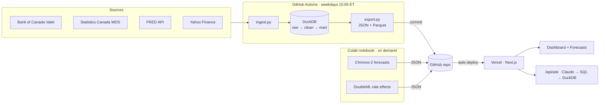

# NorthStar — Canada–U.S. Macro & Sector Intelligence

A live platform tracking the business cycle and sector rotation in Canada and the United States: automated
data pipelines, a DuckDB warehouse, a seven-section dashboard, probabilistic forecasts, causal rate-shock
estimates, and a natural-language assistant that answers questions with SQL.

**Live site:** https://www.macrointelligence.ca  
**Methodology:** https://www.macrointelligence.ca/methodology

## What it answers

| Section | Question |
|---|---|
| Output | Are the Canadian and U.S. economies expanding or entering contraction? |
| Labour | Is labour utilization tightening or softening, and how are wage pressures evolving? |
| Prices | Where are cost-push pressures relative to consumer inflation, and are central banks on target? |
| Central banks | What is the policy stance, and what is the yield curve signalling? |
| Sentiment | Where are conditions pointing over the next 3 to 6 months? |
| Trade & FX | How sensitive is Canada to currency swings, oil and cross-border trade shocks? |
| Sector rotation | How is capital rotating across sectors in each market? |
| Forecast & scenarios | What comes next, and how would a Bank of Canada rate move ripple through sectors? |
| Ask the data | Any question in plain English, answered with a visible SQL query |

## Architecture



## Stack

| Layer | Tools |
|---|---|
| Ingestion | Python, requests, yfinance; BoC Valet, StatCan WDS vector API, FRED API |
| Warehouse | DuckDB, layered SQL (raw → clean → mart), catalog-driven transforms |
| Automation | GitHub Actions (daily), data-quality gates that block bad deploys |
| Models | Amazon Chronos-2 (zero-shot, P10/P50/P90), DoubleML partially linear regression |
| Web | Next.js 16 (App Router, static pages), Tailwind CSS v4, Recharts |
| Assistant | Claude API for NL-to-SQL and answers; locked-down in-memory DuckDB on the server |

## Repository layout

```
pipeline/
  sources/        boc.py, fred.py, statcan_series.py, markets.py (+ statcan.py for full-table audits)
  sql/            01_clean.sql, 02_derived.sql, 03_marts.sql
  reference/      catalog.csv (every series: tab, unit, transform), recession dates, policy-rate history
  models/         forecast.py (Chronos-2), causal.py (DoubleML)
  ingest.py · build.py · export.py · audit.py
notebooks/        day8_models.ipynb (runs the models in Colab)
web/              Next.js app; public/data/ holds the exported JSON/Parquet
.github/workflows/refresh.yml
```

## Run it locally

```bash
# Pipeline (Python 3.11+)
python -m venv .venv && source .venv/bin/activate      # Windows Git Bash: source .venv/Scripts/activate
pip install -r pipeline/requirements.txt
export FRED_API_KEY=...                                  # free at fred.stlouisfed.org
python -m pipeline.ingest && python -m pipeline.build && python -m pipeline.export

# Web (Node 20+)
cd web && npm install
echo "ANTHROPIC_API_KEY=..." > .env.local               # only needed for Ask the data
npm run dev
```

Add a series: add a row to `pipeline/reference/catalog.csv` (plus the source ID in the right `sources/*.py`),
rebuild, and reference its name in `web/lib/tabs.ts`.

## Configuration

| Where | Name | Purpose |
|---|---|---|
| GitHub Actions secret | `FRED_API_KEY` | FRED API access from CI |
| Vercel env var | `ANTHROPIC_API_KEY` | Ask the data |
| Vercel env var (optional) | `ANTHROPIC_MODEL` | Defaults to `claude-haiku-4-5-20251001` |

## Notes and limitations

- Model outputs (`forecasts.json`, `causal_effects.json`) refresh when the Colab notebook is re-run, not daily.
- Causal estimates are exploratory: ~20 years of monthly data and few policy moves; most effects are not significant.
- The web build uses `next build --webpack`: Turbopack's external-module symlinks fail to load DuckDB's native binary on Vercel.
- Not investment advice.
